# 📚 Stacknote

> AI가 정리합니다. 당신은 검색만 하세요.

온라인에서 읽은 모든 콘텐츠를 자동으로 정리, 요약, 인덱싱하는 AI 기반 개인 지식 저장소입니다. 복잡한 수동 정리 없이, AI가 학습 패턴을 분석하고 지식을 체계화합니다.


---

## ✨ 주요 기능 (Features)

Stacknote는 다음 핵심 기능을 통해 지식 관리를 자동화합니다.
- 🔗 **자동 URL 수집 및 비동기 처리** - API 엔드포인트를 통해 URL을 수집하고, **백그라운드 큐 시스템**에서 콘텐츠 추출 및 분석을 비동기로 처리하여 사용자 경험을 최적화합니다.
- 🤖 **자동 카테고리 분류(Automatic Categorization)** - AI가 콘텐츠를 분석하여 주제별로 카테고리를 자동 생성하고 정리합니다.
- 📝 **스마트 요약 및 태그(Smart Summaries)** - 3~5줄의 핵심 요약과 관련 태그를 자동으로 생성하여 빠른 내용을 파악할 수 있습니다.
- 🔍 **의미론적 검색(Semantic Search)** - 단순히 키워드가 아닌, 내용의 의미를 기반으로 저장된 자료를 찾아줍니다.
- 💬 **개인화된 AI 에이전트 (AI Chat Interface)** - 저장된 콘텐츠와 활동 기록을 기반으로 질문에 답변하며 지식을 탐색할 수 있는 **지식 기반 대화형 에이전트**를 제공합니다.
- 📊 **활동 대시보드 및 브리핑(Activity Dashboard)** - 학습 패턴을 시각화하고, **APScheduler**를 활용하여 주기적으로 **자동 브리핑**을 제공하거나 사용자가 원하는 시점에 **수동 브리핑**을 요청하여 주요 동향을 분석합니다.
- 🔒 **프라이버시(Privacy-First)** - 콘텐츠 추출, 데이터베이스(SQLite), 및 벡터 저장소(ChromaDB)는 **모두 로컬 환경**에서 이루어지며, 개인 정보 보호를 최우선으로 설계되었습니다.

---

## 🗺️ 아키텍쳐




---

## 🛠️ 기술 스택 (Tech Stack)

### Core
- **[LangGraph](https://github.com/langchain-ai/langgraph)** - AI workflow orchestration
- **[Upstage API](https://www.upstage.ai/)** - LLM for categorization and summarization
- **[ChromaDB](https://www.trychroma.com/)** - Vector database for semantic search
- **[Trafilatura](https://trafilatura.readthedocs.io/)** - Content extraction

### Backend & Infrastructure
- **SQLite** - Metadata storage
- **APScheduler** - Background jobs (e.g., auto-briefing)
- **Requests / httpx** - HTTP client for API communication
- **NumPy & Pandas** - Data manipulation for vector operations and analysis

### Frontend & API
- **[Streamlit](https://streamlit.io/)** - Primary Web UI for the dashboard and chat interface
- **Flask (via API.py)** - Lightweight API endpoint for URL ingestion

---

## 📂 프로젝트 구조 (Project Structure)
```
stacknote/
├── app.py                # Streamlit main application
├── api.py                # Flask-based API server
├── run_desktop.py        # Desktop launcher script
├── run_desktop.spec      # PyInstaller configuration spec for building the executable
├── core/                 # Core functionality
│   ├── extractor.py      # Content extraction
│   ├── agent.py          # AI agent workflow
│   ├── classifier.py     # Content classification & summarization
│   ├── url_collector.py  # Background URL collection
│   ├── vector_store.py   # Vector database management
│   └── storage.py        # Metadata storage management
├── config/               # Configuration
│   └── settings.py       # Settings and constants
├── utils/                # Utilities
│   ├── ui.py             # UI layout components
│   └── logging.py        # Logging setup
├── extension/            # Browser extension source code
│   ├── icon.png      
│   ├── background.js     # Background script for sending URLs to the API
│   ├── manifest.json.    # Extension manifest configuration
│   ├── popup.html        # Extension popup UI
│   └── popup.js          # Extension popup logic
├── data/                 # Data directory (gitignored)
│   ├── chroma/           # ChromaDB storage
│   └── stacknote.db      # SQLite database
└── logs/                 # Logs (gitignored)
```

---

## 🚀 시작하기 (Quick Start)

### 1. 사전 요구 사항 (Prerequisites)

- Python 3.10 이상
- uv 또는 pip (종속성 관리를 위해 uv 권장)

### 2. 설치 및 환경 설정 (Installation & Setup)
```bash
# Clone the repository
git clone https://github.com/yujeong0411/stack-note.git
cd stacknote

# Install dependencies
uv sync

# Set up environment variables
cp .env.example .env
# Edit .env and add your UPSTAGE_API_KEY
```

### 4. 실행 (Run)
```bash
# Using uv
uv run streamlit run app.py

# Or using Python directly
python -m streamlit run app.py
```

브라우저에서 http://localhost:8501로 접속합니다.

---

## 📄 License

이 프로젝트는 MIT 라이선스 하에 배포됩니다. 자세한 내용은 LICENSE 파일을 참조하세요.

---

## 🙏 Acknowledgments

- [LangGraph](https://github.com/langchain-ai/langgraph) for the amazing AI framework
- [Upstage](https://www.upstage.ai/) for the Solar LLM API
- [Streamlit](https://streamlit.io/) for the rapid UI development

---

## 📧 Contact

- GitHub: [@yujeong0411](https://github.com/yujeong0411)
- Email: choiyujeong0411@gmail.com

---

**Built with ❤️ by [choi yujeong](https://github.com/yujeong0411)**
