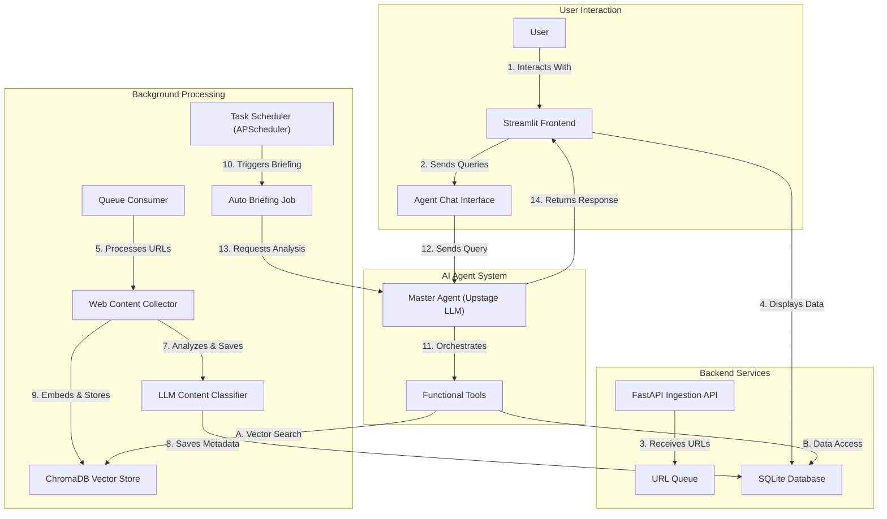

```mermaid
graph TD
    subgraph User Interaction
        U["User"] -- "1. Interacts With" --> UI["Streamlit Frontend"]
        UI -- "2. Sends Queries" --> ChatInput["Agent Chat Interface"]
    end

    subgraph Backend Services
        API["FastAPI Ingestion API"] -- "3. Receives URLs" --> URL_Queue["URL Queue"]
        UI -- "4. Displays Data" --> Storage["SQLite Database"]
    end

    subgraph Background Processing
        Consumer["Queue Consumer"] -- "5. Processes URLs" --> Collector["Web Content Collector"]
        Collector -- "7. Analyzes & Saves" --> Classifier["LLM Content Classifier"]
        Classifier -- "8. Saves Metadata" --> Storage
        Collector -- "9. Embeds & Stores" --> VectorStore["ChromaDB Vector Store"]

        Scheduler["Task Scheduler (APScheduler)"] -- "10. Triggers Briefing" --> BriefingJob["Auto Briefing Job"]
    end

    subgraph AI Agent System
        Agent["Master Agent (Upstage LLM)"] -- "11. Orchestrates" --> Agent_Tools["Functional Tools"]
        Agent_Tools -- "A. Vector Search" --> VectorStore
        Agent_Tools -- "B. Data Access" --> Storage
    end

    ChatInput -- "12. Sends Query" --> Agent
    BriefingJob -- "13. Requests Analysis" --> Agent
    Agent -- "14. Returns Response" --> UI

```